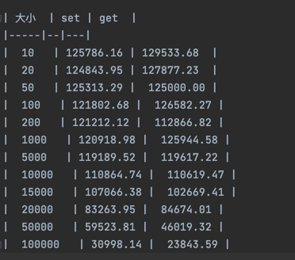
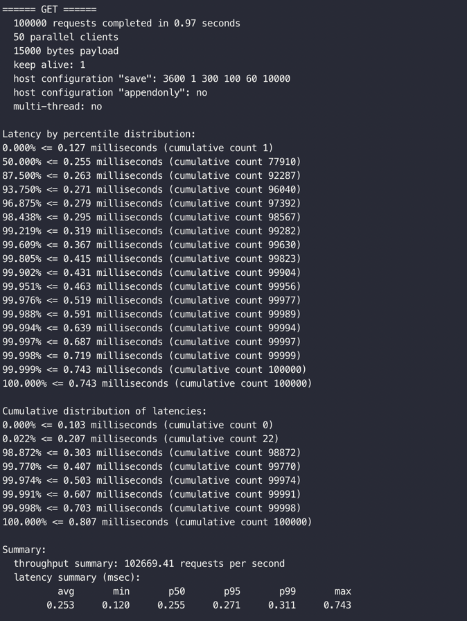

## benchmark
> 6.22 版本：https://packages.redis.io/redis-stack/redis-stack-server-6.2.2-v5.catalina.x86_64.zip

示例：redis-benchmark -t set,get -n 100000 -d 10

每个人的设备都有不太一样的，个人电脑在超过 10K 之后，有明显的下降：

| 大小  | set | get  |
|-----|--|---|
|  10   | 125786.16 | 129533.68  |
|  20   | 124843.95 | 127877.23  |
|  50   | 125313.29 |  125000.00 |
|  100   | 121802.68 |  126582.27 |
|  200   | 121212.12 |  112866.82 |
|  1000   | 120918.98 |  125944.58 |
|  5000   | 119189.52 |  119617.22 |
|  10000   | 110864.74 |  110619.47 |
|  15000   | 107066.38 |  102669.41 |
|  20000   | 83263.95 |  84674.01 |
|  50000   | 59523.81 |  46019.32 |
|  100000   | 30998.14 |  23843.59 |

